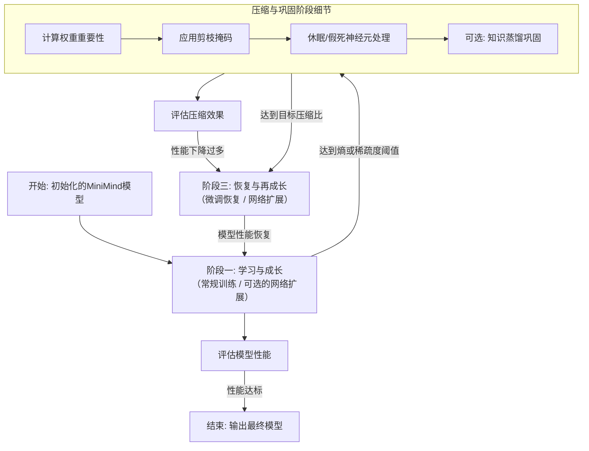

好的，我们来聊聊怎么把“训练-压缩-扩展”这个高级策略，应用到像 MiniMind 这样非常实际的项目里。

要在 MiniMind 中实现这个想法，精髓在于**把物理上、时间上独立的“预训练”和“微调”阶段，无缝地整合成一个动态循环**。下面我们就来做个整体的规划，并看看 MiniMind 的源码能做哪些小手术。

### 🗺️ 改造蓝图：融入“训练-压缩-循环”的MiniMind新流程

这个图展示了我们将传统的线性训练流程，重塑为一个动态迭代的“成长-修剪-再成长”闭环。

### 🛠️ 技术实施清单

下面是围绕这个计划，分三个阶段的具体实施步骤和技术要点。

#### **阶段一：学习与成长**
*   **基础实现**：直接沿用 MiniMind 的 `train_pretrain.py` 或 `train_full_sft.py` 作为标准训练循环。
*   **核心组件**：待改造的 Transformer 模型（`model/minimind.py`），通常包含 8 层 Transformer，隐藏层维度 512。
*   **优化方向**：
    *   **结构化扩展**：参考谷歌 MorphNet（收缩和扩展阶段的循环来优化神经网络），使用宽度乘数（width multiplier）为每层网络分配不同的资源。
    *   **动态稀疏训练（DST）**：在训练时引入动态掩码，使用 `RigL` 或 `rigl-torch` 这类工具定期剪枝、生长连接，实现“边训练边重组”。
    *   **关键监控**：“认知熵”或**矩阵基熵（MBE）**。可将该指标加入 PyTorch 的 Hook 中，实时监控模型饱和状态。

#### **阶段二：压缩与巩固**
*   **压缩策略**：采用基于绝对值大小的剪枝（Magnitude-based Pruning）或梯度敏感度评估作为标准方法，并迭代进行，在 MiniMind 的规模上完全可行。
*   **核心实现**：参考 `rigl-torch` 的 `RigLScheduler`，创建“剪枝器”对象，根据稀疏度在训练中动态剪枝最不重要或长期不活跃的神经元。
*   **诊断与复用**：注意评估剪枝后模型，如性能下降10%以上说明“压缩过猛”，此时可使用温度参数 T 和平滑 L1 损失等技术来提升恢复能力。

#### **阶段三：恢复与再成长**
*   **微调恢复**：借鉴 Transformer 剪枝的“重训练策略”（ReSt），在少量代表性数据（<3% 原始数据）上微调。
*   **知识蒸馏**：可直接复用 MiniMind 的蒸馏代码，将剪枝前原始模型作为教师网络，让剪枝后的学生模型学习其软标签，优雅地恢复性能。
*   **消除“假死”**：剪枝后若出现大量零激活神经元，可在 Hook 中检测到后，用一个极小的随机值“唤醒”它们，保持网络未来发展潜力。

### 💻 给 MiniMind 的“手术方案”：代码修改焦点

要实现这个计划，我们主要得在 MiniMind 的这几个文件上动动“小手术”：

1.  **模型定义 (`model/minimind.py`)**：需要在 Transformer 模块的 Self-Attention 和 FFN 层后**埋下“钩子”（Hooks）**，用于实时监控和诊断。
2.  **训练主程序 (`train_pretrain.py` / `train_full_sft.py`)**：在其训练循环里，需要加入一个**“智能调度器”**。它会根据 Hook 捕获的信息，判断模型是否“学累了”，并据此在**学习（阶段一）、压缩（阶段二）、恢复（阶段三）** 之间切换。
3.  **新增工具模块 (`utils/pruning_scheduler.py`)**：推荐单独创建一个文件，专门负责**执行剪枝**和**管理稀疏性**。比如 `RigL` 或 `MorphNet` 那样的算法逻辑就可以放在这里。

### 🚀 路线图：第一阶段任务清单

为了让你能马上动手，这里有一份分步操作的清单：

1.  **搭建 MVP 原型**：先把最核心的流程跑通。在一个最简单的脚本里，实现“训练 -> 剪枝 -> 微调”这三个步骤的串联。可以把 MiniMind 的 `train_pretrain.py` 代码复制一份，在这个基础上改。
2.  **实现基础的剪枝器**：在新建的 `utils/pruning_scheduler.py` 里，写一个函数。它能遍历模型的所有线性层，把绝对值最小的 10%-20% 权重给剪掉，并返回一个掩码（mask）。
3.  **整合到训练循环**：在训练脚本里，每完成一个 epoch 的训练后，调用上面的剪枝函数。然后把剪枝后的模型用更小的学习率再训练几个迭代，观察一下精度下降得多不多。

### 💎 总结

总的来说，这个策略的精髓，是把一个**物理上、时间上独立的“预训练”和“微调”阶段，无缝地整合成一个动态循环**。我们的路线是：先构建一个能完整跑通的 MVP，再引入“熵”这样的智能健康指标，最后用成熟的动态稀疏训练库（比如 RigL）来全面武装，让它真正变成一个能自主“劳逸结合”、效率极高的智能模型。